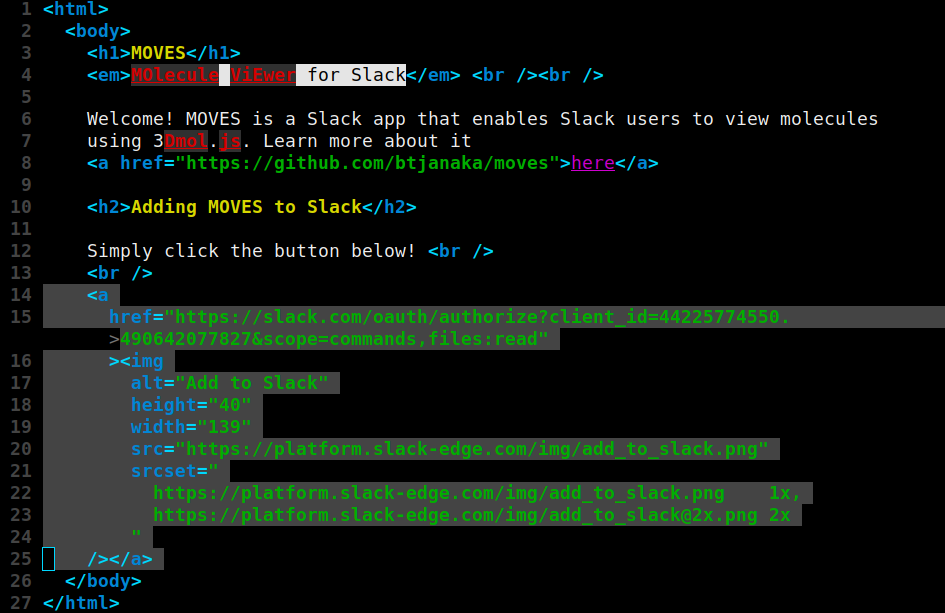
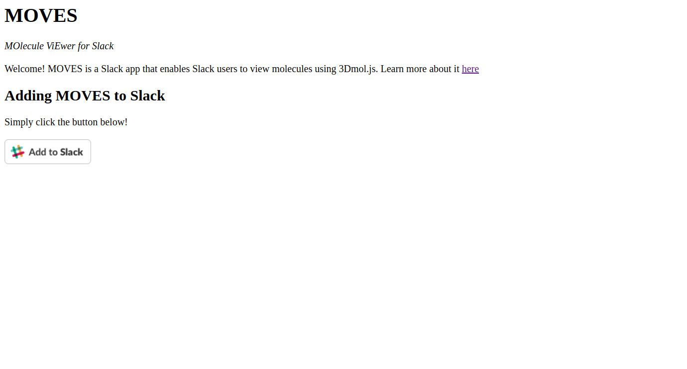

# Contributing to MOVES

<!-- toc -->

- [Overview](#overview)
- [Quick Info](#quick-info)
- [Environment](#environment)
- [Style](#style)
- [Testing](#testing)
- [Submitting Changes](#submitting-changes)
- [Server Setup Guide](#server-setup-guide)
  - [Part 1: Downloading the code](#part-1-downloading-the-code)
  - [Part 2: Setting up AWS](#part-2-setting-up-aws)
  - [Part 3: Setting up Slack](#part-3-setting-up-slack)
  - [Part 4: Running MOVES Locally](#part-4-running-moves-locally)
  - [Part 5: Deploying MOVES on Heroku](#part-5-deploying-moves-on-heroku)

<!-- tocstop -->

## Overview

Welcome! If you are here, chances are you would like to help improve MOVES. As I
myself am only a beginner Javascript developer, I could certainly use the help,
and I would really appreciate your contributions. In this document, I will go
over key topics such as how to set up a local MOVES server and how to submit
changes.

## Quick Info

Communication: bryon.tjanaka@gmail.com; I will set up a Slack workspace if more
contributors arrive

Bugs/Feature Requests: https://github.com/btjanaka/moves/issues

## Environment

To work on MOVES, you will need to set up your own local server. As such, you
will need the following software:

- node.js ([https://nodejs.org/en/](https://nodejs.org/en/))
- npm (comes installed with node.js)
- git ([https://git-scm.com/book/en/v2/Getting-Started-Installing-Git](https://git-scm.com/book/en/v2/Getting-Started-Installing-Git))

If you lack any of this software, please follow the links above for installation
instructions for your operating system.

## Style

This project uses a mixture of the [Google Javascript Style
Guide](https://google.github.io/styleguide/javascriptguide.xml) and
[prettier](https://prettier.io) to maintain a consistent style. eslint with
[Google's eslint configuration](https://github.com/google/eslint-config-google)
is used for static analysis, while Prettier is used for handling all formatting.
[eslint-config-prettier](https://github.com/prettier/eslint-config-prettier) is
used to prevent formatting conflicts between eslint and Prettier. For more info
on creating such a setup, please see this
[tutorial](https://www.39digits.com/configure-prettier-and-eslint-in-visual-studio-code/)
by 39digits (you can ignore the part about VSCode if you do not use it; I
personally prefer Vim :D).

Currently, there is one particular eslint rule that I turned off on purpose,
called "require-jsdoc". Since this is a small project so far, I have decided not
to use JSDoc, but I may in the future.

Overall, you do not have to worry about manually managing style. I have used
[husky](https://github.com/typicode/husky) and
[lint-staged](https://github.com/okonet/lint-staged) to implement a precommit
hook, which runs when you attempt to commit changes. It does the following to
the files you have staged:

- Runs [markdown-toc](https://github.com/jonschlinkert/markdown-toc) on md files
- Runs eslint on js and jsx files
- Runs prettier on js, jsx, json, html, and md files

See another
[tutorial](https://www.39digits.com/automatically-format-your-javascript-commits-using-prettier-and-husky/)
by 39digits for more info on setting up this automatic formatting.

## Testing

There are currently no tests, but I am working on using [Steno](https://slackapi.github.io/steno/) to test the server.

## Submitting Changes

To submit changes, [fork](https://github.com/btjanaka/moves/fork) this
repository and make changes to it. When you are ready, submit a pull request and
I will review the code and accept it.

## Server Setup Guide

This guide will walk you through the steps to start MOVES on both a local server
and on Heroku. In order to develop MOVES, you will only need to set up the local
server, so you will only need to follow Part 1-4. If you want to run MOVES
on your own, follow the whole guide (Part 1-5). Or you can skip Part 5 and start
MOVES on some platform other than Heroku.

_Note: You may want to take a glance at
these directions before doing them; they represent quite a bit of effort._

### Part 1: Downloading the code

1. [Fork](https://github.com/btjanaka/moves/fork) this repository and then clone
   your forked copy (I include the link to this repository in the example
   below). Then enter the repository.

   ```
   git clone https://github.com/btjanaka/moves
   cd moves
   ```

1. Install dependencies for the project. This also installs several
   devDependencies, tools that are used to help develop the project.

   ```
   npm install
   ```

1. Create a .env file by copying the .sampleenv file from the docs folder. This
   file contains several key environment variables that we will fill in through
   the following steps. Prior to running MOVES later on, you will need to
   source the .env file.

   ```
   cp docs/.sampleenv .env
   ```

### Part 2: Setting up AWS

1. Sign up for an AWS account at
   [https://portal.aws.amazon.com/billing/signup#/start](https://portal.aws.amazon.com/billing/signup#/start).
   You will need a credit card to sign up, but they will not charge you unless
   you exceed the limits of the free trial.

1. Go to the s3 console at
   [https://console.aws.amazon.com/s3](https://console.aws.amazon.com/s3) and
   click on the "Create Bucket" button. Enter an appropriate name, and choose
   the region to be somewhere close to you (e.g. here in Irvine, CA, I chose "US
   West (N. California)"). There are some benefits associated with having a
   bucket be near you. On Page 2, called "Configure Options", you do not have to
   change anything; just leave them at the defaults. On Page 3, called "Set
   permissions", uncheck all 4 checkmarks. This allows MOVES to create files in
   the bucket that can be accessed by 3DMol.js. Once you reach Page 4, simply
   click "Create Bucket". If you have any trouble with this step, see
   [https://docs.aws.amazon.com/AmazonS3/latest/gsg/CreatingABucket.html](https://docs.aws.amazon.com/AmazonS3/latest/gsg/CreatingABucket.html).

1. In the .env file, set the `S3_BUCKET_NAME` variable to the name of the
   bucket.

1. Create an empty file called teams.csv. This file stores authentication data
   related to each workspace where MOVES operates.

   ```
   touch teams.csv
   ```

1. Upload the empty teams.csv file to the s3 bucket. Click on the name of the
   bucket, click on the "Upload" button, and find the teams.csv file. Give it
   the default settings (i.e. do NOT make it publicly available for read/write -
   that allows other people to see the file and mess around with the
   workspaces). Uploading the file prevents the server from crashing when it
   tries to access the file later.

   - I may work on a fix for uploading a teams.csv file if there is none
     present, but it is low priority because you only have to do this once.

1. To obtain the `S3_BUCKET_URL`, go to the "Overview" tab for the teams.csv
   file by clicking on its name. Scroll down and copy the "Object URL". Once you
   remove the filename and the extra slash at the end, you will have the value
   of the `S3_BUCKET_URL`. For instance, your URL might be something like
   https://s3-us-west-1.amazonaws.com/moves-test-assets. Make sure to paste the
   URL into the .env file.

1. Follow the instructions
   [here](https://docs.aws.amazon.com/general/latest/gr/managing-aws-access-keys.html)
   to create and download access keys for AWS. Note that you only have one
   chance to download these keys, or you will need to create new ones. Once you
   have the keys, paste them into the .env file under the `AWS_ACCESS_KEY_ID`
   and `AWS_SECRET_ACCESS_KEY` variables.

### Part 3: Setting up Slack

1. Create a Slack workspace at
   [https://slack.com/create#email](https://slack.com/create#email).

1. Create a Slack app for your new workspace at
   [https://api.slack.com/apps](https://api.slack.com/apps) by clicking on
   "Create New App". Make sure the "Development Slack Workspace" is the
   workspace you just created.

1. On your app's "Basic Information" page, you will see the "Client ID", "Client
   Secret", and "Signing Secret" under "App Credentials". Copy all of these to
   the .env file, where they are marked as `SLACK_CLIENT_ID`,
   `SLACK_CLIENT_SECRET`, and `SLACK_SIGNING_SECRET`, respectively.

1. Go to the "Slash Commands" tab to add a slash command by clicking on the
   "Create New Command" button. Give it a name like /moves, and a description
   like "view a molecule". Usage hint can be something like "[file URL]".
   Fill in the URL with some random URL like https://moves.com for now; we
   will get back to it later. For now, click save but do not close the tab.

### Part 4: Running MOVES Locally

1. Open up a tunnel to your server using ngrok. You will have to do this in a
   separate window, as ngrok takes over the terminal window where it is running.

   ```
   node_modules/.bin/ngrok http $PORT
   ```

1. Take note of the _https_ link that ngrok outputs next to "Forwarding".

1. Put this link into the .env file as the value for the `MOVES_APP_URL`
   variable.

1. Back in the setup page for Slack, edit the slash command you created by
   clicking on the pencil icon to the right of its name. Then, paste the URL
   from step 2 into the URL field and append "/view" to it, so that the URL
   looks like https://xxx.ngrok.io/view.

1. From your Slack setup page, navigate to the "OAuth & Permissions" tab and
   find the "Redirect URLs" section. Paste the URL there and append
   "/auth/redirect" to it, so that the URL looks like
   https://xxx.ngrok.io/auth/redirect. Make sure to save the URL after
   entering it.

1. Still on the "OAuth & Permissions" tab, scroll down to the "Scopes" section.
   Under "Select Permission Scopes", type in "files:read" and select the result
   which pops up. Click "Save Changes". This will allows MOVES to access files
   on workspaces where it is installed.

1. Still on Slack, go to the "Manage Distribution" page and scroll down to
   the bottom. Click on the "Remove hard-coded information" section and
   check the box. Then click on "Activate Public Distribution".

1. At the top of the page, you should now see the HTML for an "Add to Slack"
   button. Copy this HTML and use it to replace the highlighted HTML below in
   the file pages/index.html.



1. Create a new terminal window in the same directory and set the environment
   variables for MOVES.

   ```
   source .env
   ```

1. In that newly created window, start your server with nodemon.

   ```
   node_modules/.bin/nodemon server.js
   ```

1. Visit the ngrok URL from earlier in your browser, and you should see a page
   like this:

   

1. Click on the "Add to Slack" button to add your test version of MOVES to
   your test Slack workspace.

1. Congratulations, you should be set up to test MOVES locally now! On Slack,
   you should be able to use the slash command you made earlier with a file
   URL, and a URL to the view should be returned. Note that since ngrok URL's
   only last for 8 hours, you will have to refresh the link for the slash
   command every time you use a new ngrok URL (see Step 4). If you are testing
   authentications, then you will have to change the OAuth redirect URL and the
   "Add to Slack" button's HTML each time as well. Read on if you wish to
   deploy the app to Heroku.

### Part 5: Deploying MOVES on Heroku

1. Set up a Heroku account at
   [https://signup.heroku.com](https://signup.heroku.com). If you get stuck on
   the next few steps, you may want to refer to
   [https://devcenter.heroku.com/articles/getting-started-with-nodejs](https://devcenter.heroku.com/articles/getting-started-with-nodejs)
   for more information.

1. Install the Heroku CLI using Snap.

   ```
   sudo snap install heroku --classic
   ```

1. Login to the Heroku CLI. You will be asked to login in a browser window.

   ```
   heroku login
   ```

1. Create a Heroku app.

   ```
   heroku create your-name-here
   ```

   A URL for the app should be returned in the process; something like
   http://your-name-here.herokuapp.com (make sure to remove the slash at the end
   if there is one). Copy this URL and paste it into the .env
   file as the value of `MOVES_APP_URL`. Also use this URL to replace the ngrok
   URL from earlier for both the slash command and the OAuth redirect URL in
   Slack. You will also have to change the HTML for the "Add to Slack" button.
   Refer to Part 3 if you need help.

1. Source the environment variables and then configure Heroku environment
   variables using the `heroku_config.sh` script.

   ```
   source .env
   heroku_config.sh
   ```

1. Commit your change to the "Add to Slack" button.

   ```
   git add pages/index.html
   git commit -m "Change Add to Slack button"
   ```

1. Push the code to Heroku.

   ```
   git push heroku master
   ```

1. Congratulations! MOVES should now be running. You may have to reinstall it
   to your workspace by visiting the herokuapp URL and clicking the "Add to
   Slack" button. Then, you can try out a slash command on Slack, and visit your
   herokuapp URL from earlier to see that it works. If you want others to
   install the app on their workspace, ask them to visit the herokuapp URL and
   click the button as well.
