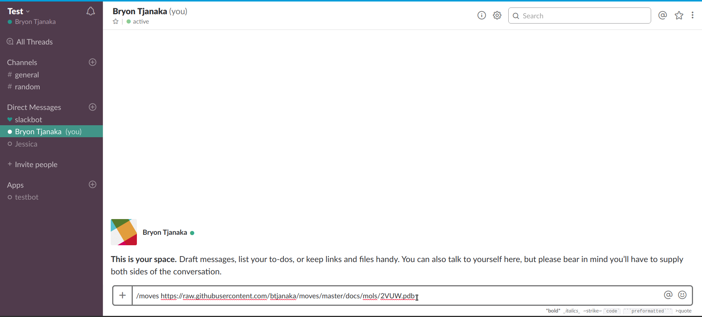

# MOVES - MOlecule ViEwer for Slack

<!-- toc -->

- [Overview](#overview)
- [Usage](#usage)
  - [Possible Errors](#possible-errors)
  - [A Note on Slack File Links](#a-note-on-slack-file-links)
  - [Filetypes Supported](#filetypes-supported)
  - [Known Bugs](#known-bugs)
- [Tutorials](#tutorials)
  - [Slack files](#slack-files)
  - [Github files](#github-files)
- [Contributing](#contributing)
- [Credits](#credits)

<!-- tocstop -->

## Overview

In the field of computational chemistry, the ability to quickly and easily view
molecules is incredibly important. Currently, many research groups, such as the
Mobley Lab at UC Irvine, use Slack for communication purposes. When they share
molecule files, they are required to download the file and open it in a local
viewer. This greatly hampers the efficiency of communication; furthermore, it
makes it nearly impossible to view molecules on the go. MOVES (MOlecule ViEwer
for Slack) is a Slack app that solves this problem. By interfacing with
[3DMol.js](http://3dmol.csb.pitt.edu/index.html), MOVES enables users to view
molecules without the need for any external viewer.

In terms of implementation, MOVES is a server using Express.js. It currently
runs on Heroku, with an Amazon S3 bucket used for storage.

## Usage

MOVES is invoked as a slash command within Slack:

```
/moves [file URL]
```

The file URL can be a link to:

- A molecule file on the team's Slack\*
- A molecule file on some external link

After the file URL is passed via the slash command, MOVES will return a link
where the file may be viewed using 3DMol.js, or an appropriate error message.

\* This must be a link to a file, not a link to a message with a file. You can
obtain this link by hovering over the top right corner of the preview, clicking
on the three dots that appear, and clicking "Copy link to file". See the [Slack
tutorial](#slack-files) for more info.

### Possible Errors

- **Slack may give a timeout error for MOVES. This happens becaues the MOVES
  server may be inactive (It runs on a free account on Heroku, which puts the
  server to sleep after 30 minutes of inactivity). If this occurs, wait a few
  seconds and try again.**
- If the link is a Slack file link, MOVES may give an error if:
  - The Slack file is not one of the supported molecule file types
  - The Slack file is not on the correct Slack (i.e. MOVES cannot access it)
- If the link is an external link or a Slack link (but not to a file), 3DMol.js
  may give a blank screen if the file does not exist or cannot be accessed.
- If the link is not a URL, an appropriate message is returned.

### A Note on Slack File Links

When given a Slack file link, MOVES downloads the file and stores it. There are
two important implications associated with this:

1. **Slack file links are "public."** Anyone with a link to the molecule file
   can download it. If you do not mind this, there is nothing to worry about;
   however, if you are developing a top secret molecule, MOVES may not be the
   best option.
1. **Slack file links may not work after 24 hours.** For every 100 files it
   receives, the server does a sweep to remove any files that are over 24 hours
   old, so your file may not be available anymore. Since there is still not much
   traffic, this is unlikely to affect you for now, but if it does, simply send
   MOVES the link again on Slack.

### Filetypes Supported

The filetypes MOVES supports are based entirely on the ones that 3DMol.js
supports. As of writing, these filetypes are `pdb`, `sdf`, `mol2`, `xyz`, and
`cube`.

### Known Bugs

Currently there appears to be a bug where MOVES erroneously tells users that the
Slack file they gave may be on another team's Slack. I am unsure why this
happens; all I know is that it has something to do with MOVES failing to access
these files.

## Tutorials

Here are several tutorials for using MOVES to view molecule files.

### Slack files

To view a Slack file, first upload the file.


Once the file is uploaded, hover over the top right corner and three dots will
appear.


Click on the three dots and then "Copy link to file".


Enter the command "/moves" and paste the link.


Send the message and you should receive a link from MOVES. Click on the link to
view the molecule!


### Github files

For Github molecule files, first navigate to the appropriate page on Github.
Then, select the "raw" option for viewing the file.


After choosing the raw version, you might see a webpage like this. Copy the
URL of the page.


Go to Slack and enter the command "/moves". Then, paste the link and send the
message.



You should now have the link!


## Contributing

See [CONTRIBUTING.md](CONTRIBUTING.md)

## Credits

This project was completed under the auspices of the [Mobley
Lab](https://mobleylab.org). Many thanks to Dr. Mobley, Jessica Maat, and the
entire lab!
